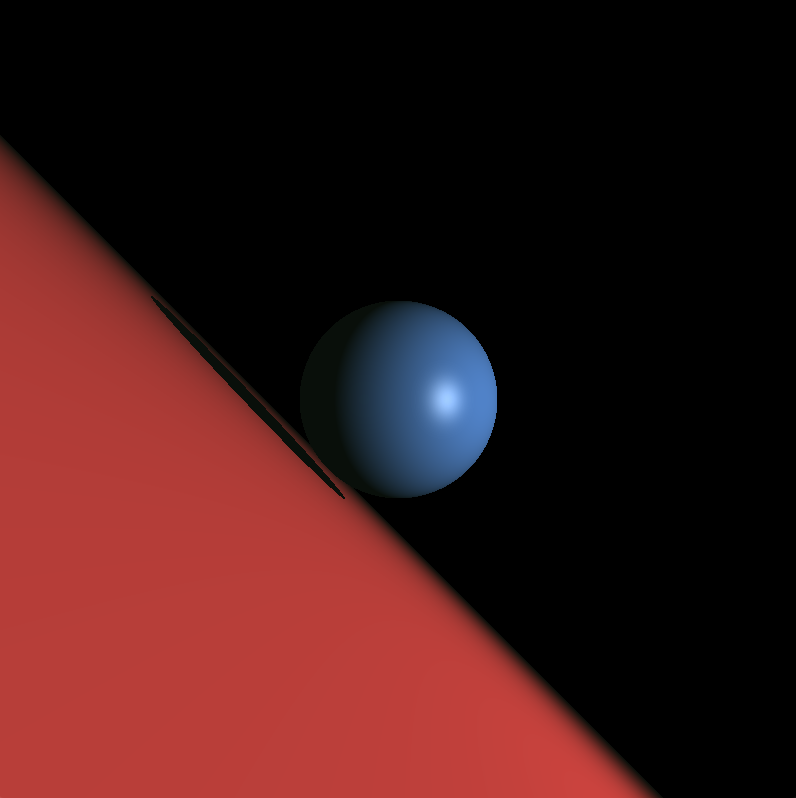
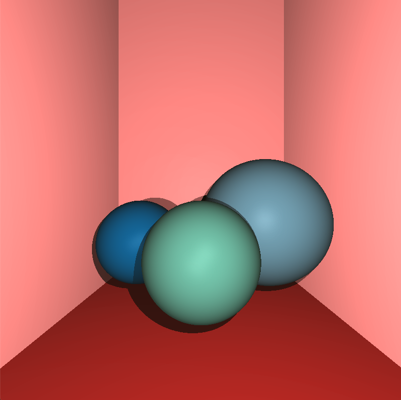
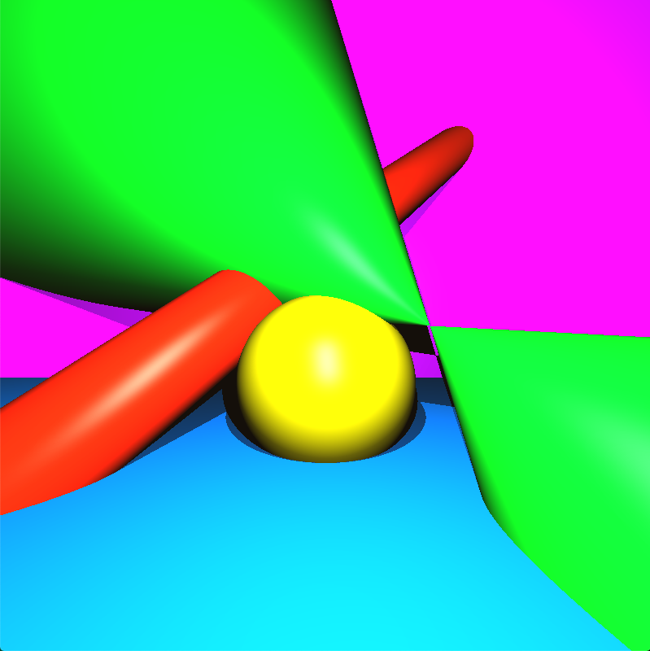

# RTv1
Ray Tracer Version One

A precursor 3D ray-tracing program that renders computer generated images, including a debugging xml-parser. 

A 42 project done with Samuel Boniface (@sabonifa).

## INSTALLATION
Run make inside the repo.
```
$ make path/to/repo
```

## LAUNCHING PROGRAM
The program takes an xml scene file as the input, you can create your own or use the already created scenes.
*NOTE: The parser is very strict, so please be sure to check out the scenes/all_shapes.xml file to see how scenes are to be written.*
```
$ ./rtv1 scenes/file_name.xml
```

## FEATURES
- 4 Objects: cone, cylinder, plane, sphere
- Shadows
- Multispot Lighting
- Ambient lighting (filteresque effect)
- Translation and rotation (camera and shapes)
- XML parsing and debugging

An example of a plane and sphere
# 

Multiple spheres and planes interacting to create the effect of a room of balls
# 

All possible shapes rendered in bright neon colors
# 
